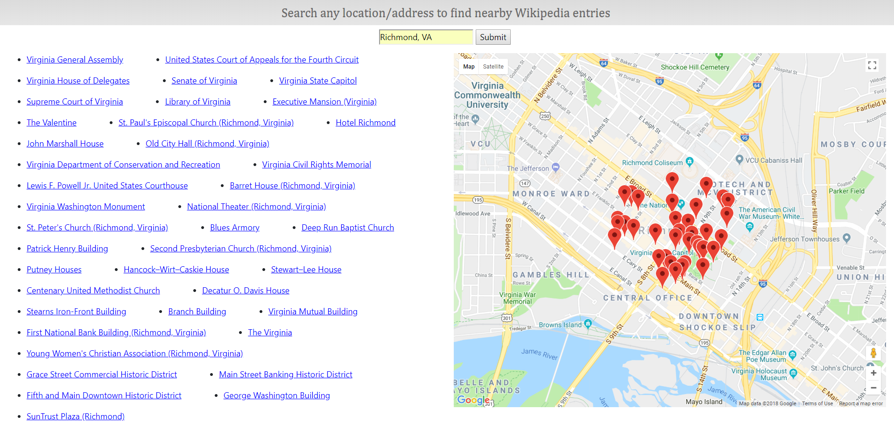

# wikigeo

This is an app that allows you to search for nearby Wikipedia entries of any location. The entries closest to the location you used will be displayed on a map and the page will also display hyperlinks for each entry.

